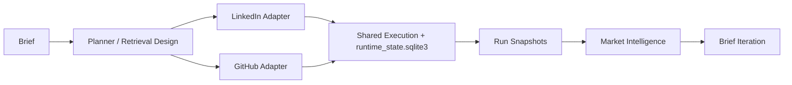

# Sourcing Agent

Sourcing Agent is a role-driven sourcing platform for LinkedIn Recruiter and GitHub. It turns a structured hiring brief into search strategy, staged candidate evaluation, runtime-backed execution, end-of-run artifacts, market intelligence, and draft brief iteration.

The repo started as an autonomous search agent. The current system is broader than that: it includes source adapters, a shared execution/runtime layer, operator tooling, market-level synthesis, and a workflow for turning run evidence back into the next version of a brief.

## What The System Is

The brief is the center of the system. It captures the role-specific judgment that is usually scattered across intake notes, recruiter memory, search strings, and ad hoc evaluation habits:

- what kind of work the team actually needs
- where the yes/no boundary sits
- which lookalike profiles usually waste time
- how search should open
- what kinds of evidence matter on LinkedIn and GitHub

That judgment is made executable. The result is a reusable role definition that can drive planning, evaluation, adaptation, reporting, and post-run iteration.

The loader supports older brief formats as well as the newer structured schema. Newer briefs can also carry an explicit `retrieval_design`, which lets the search open from layered intent rather than a flat list of terms.

## How A Run Works

1. Load a brief and normalize its judgment, search priorities, and permanent filters.
2. Derive retrieval/search strategy for the source being run.
3. Execute the source adapter:
   - LinkedIn via browser automation inside Recruiter
   - GitHub via API-driven search and enrichment
4. Discover and evaluate candidates in stages:
   - lightweight snippet pass
- deeper profile review for promising candidates
5. Persist canonical candidate/work-unit/runtime state in `runtime_state.sqlite3`.
6. Rebuild compatibility artifacts and finalize immutable run snapshots.
7. Update market intelligence from finalized run evidence with external research via Perplexity's API.
8. Draft the next version of the brief from what the run learned.



## Architecture

The system has six major layers:

- **Brief and policy layer**
  - structured role judgment, search guidance, save criteria, non-fit patterns
- **Planning layer**
  - retrieval design, search formation, adaptation, query evolution
- **Source adapters**
  - LinkedIn Recruiter browser workflow
  - GitHub API search, enrichment, graph expansion, outreach/export side effects
- **Shared execution/runtime layer**
  - canonical candidate lifecycle, attempt tracking, side-effect ledgers, resume state
- **Run artifact layer**
  - compatibility projections, run snapshots, structured reports
- **Market intelligence and brief iteration**
  - per-market synthesis, optional research, draft brief updates from real run evidence

Two docs go deeper on the execution/runtime model:

- [Runtime-State Operator Runbook](docs/runtime-state-operator-runbook.md)
- [Shared Candidate Execution Engine](docs/shared-candidate-execution-engine.md)

For refactor history and what remains as product work rather than architecture debt, see [Sourcing-Agent-2nd-Gen-Roadmap.md](Sourcing-Agent-2nd-Gen-Roadmap.md).

## LinkedIn Capabilities

The LinkedIn adapter connects to a live Chrome session over CDP and works inside LinkedIn Recruiter. It is not just a static string runner.

Current LinkedIn capabilities include:

- two-stage snippet-to-profile evaluation
- role-driven search string generation from the brief
- root query families with sibling variants
- pre-commit experimentation before locking onto a pagination path
- mid-string drift rescue when a once-productive query decays
- runtime-backed search memory and candidate history
- mutation budgeting so search changes stay bounded and auditable
- session orchestration, pacing, budgets, resume/restart support, and optional decoy activity

The important architectural point is that LinkedIn search intelligence is more than “narrow or broaden.” It now tracks search families, experiments within them, and persists that search state in the runtime layer.

## GitHub Capabilities

The GitHub adapter uses API-driven search rather than browser automation. It works across multiple acquisition channels, including:

- user search
- code search
- topic and repository mining
- stargazer and graph expansion from strong candidates

It enriches candidates with repository, contribution, profile, and contact data before running the same kind of structured judgment flow used on LinkedIn.

For saved candidates, the GitHub side can generate outreach copy and export operator-facing CSVs. Strong candidates can also feed graph expansion so the search moves outward from actual signal rather than staying trapped in the original query set.

## Runtime State And Output Model

The shared runtime model is the core of the current architecture.

`runtime_state.sqlite3` is the authoritative record of:

- candidate lifecycle
- work-unit status
- attempt history
- side effects
- resume state

The four storage layers are:

1. **Live project state** in `output/state/...`
   - mutable, project-scoped working state
   - canonical `runtime_state.sqlite3`

2. **Compatibility projections**
   - `progress.json`
   - stage JSONLs
   - `candidate_history-*.jsonl`
   - `search_memory-*.json`
   - useful operational artifacts, but not control-state inputs

3. **Finalized run snapshots** in `output/runs/...`
   - immutable per-run archives
   - used for reporting, replay, and post-run synthesis

4. **Market artifacts** in `output/market_intelligence/...`
   - canonical per-market synthesis
   - separate from per-project LinkedIn or GitHub run state

In practice:

- LinkedIn live state is scoped to the LinkedIn project / brief state key
- GitHub live state is scoped to the GitHub brief ID
- market intelligence is scoped to a derived market key
- projections are rebuildable from runtime state when needed

That distinction matters: live project state, run snapshots, and market artifacts are different layers with different jobs.

## Operating Modes And Safety

On LinkedIn, the system operates through a CDP-connected Chrome session and supports two input modes:

- `concurrent`
  - synthetic mouse/input path that is safer while you keep using the computer
- `away`
  - real mouse/keyboard takeover mode for unattended sessions

The operational model also includes:

- humanized pacing and cadence rather than bursty automation
- bounded search mutation rather than constant query rewriting
- runtime-state-first resume and recovery
- optional decoy activity for safer long-running Recruiter sessions

This repo is not structured around fragile file-edit recovery. When runtime state exists, the canonical recovery/admin surface is `tools/runtime_state_admin.py`.

## Post-Run Learning Loop

Market intelligence is a first-class subsystem, not just report generation.

It consumes finalized run evidence, produces canonical per-market artifacts, can optionally run external research, maintains its own market-keyed artifact/state layer, and feeds both operator strategy and brief iteration.

The post-run loop looks like this:

- finalize a run snapshot
- synthesize what the run actually learned
- update canonical market artifacts
- optionally enrich that synthesis with external research
- draft the next version of the brief from run evidence plus market intel

That is how the system gets continuity across runs instead of treating each session as an isolated sourcing episode.

## Repository Layout

```text
sourcing-agent/
├── config/                # Role briefs and supporting job-description files
├── linkedin/              # LinkedIn Recruiter adapter, browser automation, search intelligence
├── github/                # GitHub adapter, enrichment, query planning, exports, observability
├── market_intelligence/   # Post-run synthesis, research backends, artifact generation
├── shared/                # Brief loading, schemas, runtime state, execution engine, utilities
├── tools/                 # Runtime admin, brief iteration, market-intel update helpers
├── docs/                  # Runbooks, cheat sheets, architecture notes, archived campaign docs
└── output/                # Mutable state, finalized run snapshots, exports, market intel
```

## Setup

```bash
python3 -m venv .venv
source .venv/bin/activate
pip install -r requirements.txt
cp config.example.env .env
```

Fill in the keys you need in `.env`.

- `ANTHROPIC_API_KEY` is required for higher-judgment steps.
- `OPENAI_API_KEY` or `GOOGLE_API_KEY` is used for lower-cost extraction and synthesis work.
- `GITHUB_TOKEN` is required for GitHub sourcing.
- `PERPLEXITY_API_KEY` is optional and only matters if you want external research during market-intelligence updates.

If you plan to run LinkedIn, start Chrome through the helper script and keep your Recruiter session logged in:

```bash
./launch-chrome.sh
```

## Common Commands

These examples use two current briefs that already exist in the repo:

```bash
LINKEDIN_BRIEF=config/Forward-Deployed-Engineer-NYC/brief-forward-deployed-engineer-us-v1.4.json
GITHUB_BRIEF=config/Forward-Deployed-Engineer-NYC/brief-forward-deployed-engineer-us-github-v1.json
```

### LinkedIn runs

Recommended entry point:

```bash
python3 linkedin/session_orchestrator.py --brief "$LINKEDIN_BRIEF"
```

Useful variants:

```bash
python3 linkedin/session_orchestrator.py --brief "$LINKEDIN_BRIEF" --single-session
python3 linkedin/session_orchestrator.py --brief "$LINKEDIN_BRIEF" --resume
python3 linkedin/session_orchestrator.py --brief "$LINKEDIN_BRIEF" --status
python3 linkedin/session_orchestrator.py --brief "$LINKEDIN_BRIEF" --restart-string 12 --resume
python3 linkedin/session_orchestrator.py --decoy-only
```

If you want the direct pipeline without the session orchestrator:

```bash
python3 run_linkedin.py --brief "$LINKEDIN_BRIEF" --full-run
```

### GitHub runs

Recommended entry point:

```bash
python3 run_github.py --brief "$GITHUB_BRIEF"
```

Useful variants:

```bash
python3 run_github.py --brief "$GITHUB_BRIEF" --resume
python3 run_github.py --brief "$GITHUB_BRIEF" --status
python3 github/session_orchestrator.py --brief "$GITHUB_BRIEF" --single-session
python3 github/run.py --brief "$GITHUB_BRIEF"
```

### Post-run workflow

Update market intelligence from a finalized run snapshot:

```bash
python3 tools/update_market_intel.py \
  --brief "$LINKEDIN_BRIEF" \
  --run-dir output/runs/linkedin/<brief-id>/<run-stamp>__run-<id> \
  --mode post_run
```

Draft the next version of a brief from a run report:

```bash
python3 -m tools.iterate_brief \
  --brief "$LINKEDIN_BRIEF" \
  --report output/runs/linkedin/<brief-id>/<run-stamp>__run-<id>/run-report.json \
  --search-memory output/runs/linkedin/<brief-id>/<run-stamp>__run-<id>/search_memory-<brief-id>.json \
  --final-judgments output/runs/linkedin/<brief-id>/<run-stamp>__run-<id>/final_judgments.jsonl \
  --output-dir output
```

### Runtime administration

If a run already has `runtime_state.sqlite3`, use the admin surface instead of editing `progress.json` or JSONL files by hand:

```bash
python3 tools/runtime_state_admin.py \
  --output-dir output/state/linkedin/<brief-id> \
  --source linkedin \
  --brief-id <brief-id> \
  rebuild-projections
```

Other supported admin operations include inspecting orphaned attempts, inspecting stop reasons, replaying side effects, requeueing work units, and restarting a specific LinkedIn string.

## Testing

The repo has a broad test suite around runtime state, search intelligence, adapter services, market intelligence, brief iteration, and the shared execution layer.

```bash
make validate
```

For the explicit validation profiles:

- `make validate`
  - repo hygiene checks plus the default green suite
- `make test-default`
  - the default green pytest profile
- `make test-full`
  - the full pytest surface, including heavier dataset replay coverage

The validation policy is documented in [docs/validation-standard.md](docs/validation-standard.md).

## Notes

This is an internal project. The system is intentionally opinionated because it is designed to preserve sourcing judgment alongside automation. The newer parts of the repo reflect that direction: stronger runtime discipline, clearer operator tooling, richer market-level synthesis, and a tighter loop between what the search learns and how the brief evolves.

## License

Private and internal use only.
