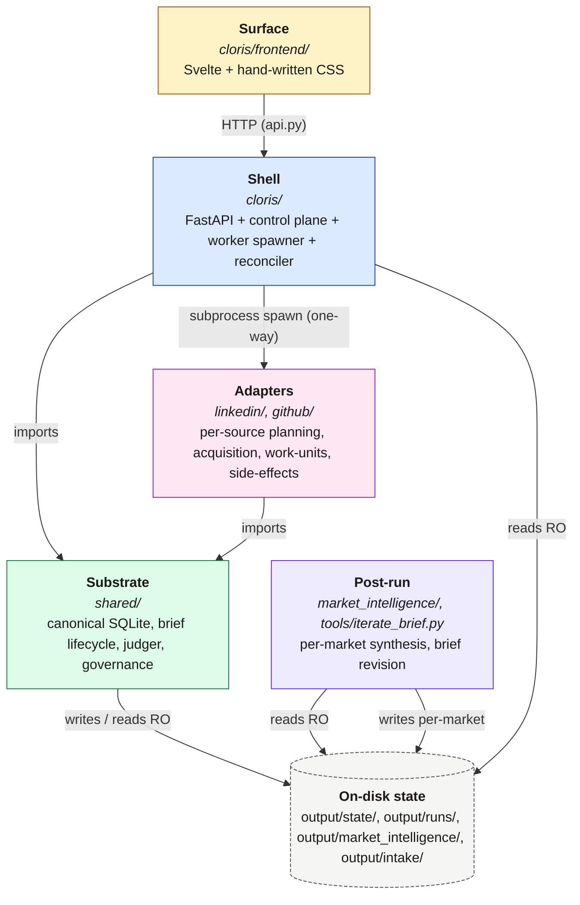
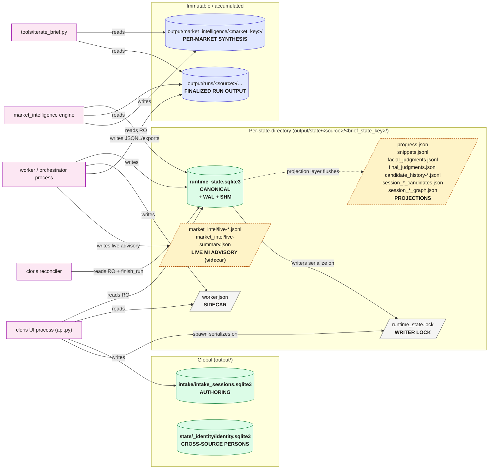
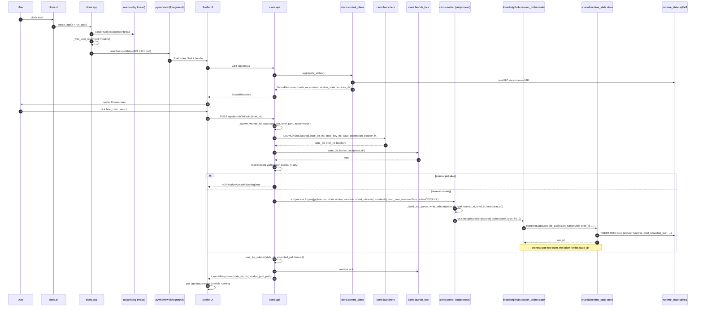
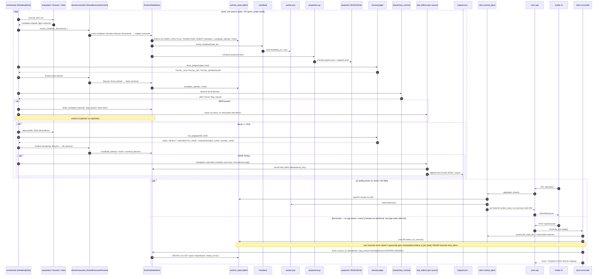

# Cloris Architecture Map

Status: living
Owner: Sam
Last updated: 2026-05-02

This is the visual companion to the prose architecture docs. It diagrams the system; the prose docs explain it.

- For invariants (normative): `Cloris-Architecture-North-Star.md`
- For narrative ("how it works, in English"): `docs/how-cloris-works/how-it-works.md`
- For control-plane semantics: `docs/cloris-control-plane-spec.md`
- For the adapter ↔ shared boundary: `docs/shared-candidate-execution-engine.md`
- For UI surfaces and roles: `docs/cloris-ui-spec.md`
- For module integration mechanics: `docs/cloris-module-integration-contract.md`

If a diagram in this file disagrees with one of the docs above, the prose doc is normative — open a PR to fix the diagram.

---

## 0. Orientation

The repo is a sourcing platform with **four layers** plus a **post-run** synthesis pipeline. All five communicate through a small set of canonical-state surfaces.

| Layer | Lives in | One-line role |
|---|---|---|
| Surface | `cloris/frontend/` (Svelte + hand-written CSS) | What the recruiter sees and clicks |
| Shell | `cloris/` (FastAPI + Python) | The local desktop process: API, control plane, worker spawner, reconciler, intake |
| Substrate | `shared/` | Canonical state, brief lifecycle, evaluation engine, governance, safety |
| Adapters | `linkedin/`, `github/` | Per-source planners, work-units, browser/API drivers, side-effects |
| Post-run | `market_intelligence/`, `tools/iterate_brief.py` | Per-market synthesis and brief revision |

**Where to look for what:**

| If you want to understand… | Read… |
|---|---|
| Why a candidate row exists in two places at once | `Cloris-Architecture-North-Star.md` §2 ("Source discrimination is universal") |
| Why projections are not control state | `Cloris-Architecture-North-Star.md` §1 + `shared/runtime_state/projections.py` |
| What the worker actually spawns | `cloris/launchers/__init__.py:223-235` (the registry) |
| Why a "running" run can suddenly become "abandoned" | `cloris/reconciler.py` (zombie reconciler) |
| Where a brief's calibration lives | `shared/brief_schema.py:179-260` + `shared/brief_iteration.py` |
| How market intelligence accumulates across runs | `market_intelligence/engine.py:181-188` (per-market key) |
| Why the UI cannot corrupt a running run | `cloris/control_plane.py:8-17` (read-only sqlite open) |

---

## 1. The layered map

Two passes. **§1a** is the bird's-eye — five layers, the dependency arrows between them, no internal detail. Read it once. **§1b** is a module inventory per layer, in tabular form, for when you're tracing a specific call path. (A single sprawling Mermaid diagram with every module would render too wide to read in a normal viewer; the table is more searchable and ages better.)

### 1a. Bird's-eye

**Five facts the bird's-eye view is asserting:**

1. **Surface only ever talks to the Shell over HTTP.** No Svelte file imports anything from `shared/` or the adapters. The seam is `cloris/api.py`.
2. **The Shell never imports the canonical writer in read paths.** `cloris/control_plane.py` is read-only (`cloris/control_plane.py:8-17`); the writers are the worker subprocess, the reconciler's lazy-imported apply step (`cloris/reconciler.py:194-196`), and `intake_sessions.py`. One narrow exception: `control_plane.py::aggregate_briefs` lazy-imports `cloris.api` to scan authored briefs (`cloris/control_plane.py:954-956`) — a known cycle bridged by lazy import, not a clean DAG.
3. **Adapters never call back into `cloris/`.** The dependency is Shell → Adapters, never reverse. Once the worker `execvp`s into the orchestrator, the API process and the adapter process talk only through canonical SQLite + the `worker.json` sidecar. That's what lets the worker outlive the UI window (`Cloris-Architecture-North-Star.md` §6).
4. **Both adapters share `shared/execution/`, `shared/judger.py`, and `shared/runtime_state/store.py`.** Source-specific code is `acquisition.py`, `work_units.py`, `side_effects.py`, `strategy.py`, `judgment_templates.py` — and only those (`docs/shared-candidate-execution-engine.md`).
5. **Post-run synthesis is triggered from inside the adapter, not from the Shell.** `market_intelligence/` does not write to `output/state/...`; it only writes to `output/market_intelligence/<market_key>/`. For LinkedIn, the trigger fires automatically inside `linkedin/run_report.py::finalize_linkedin_run_snapshot` immediately after the snapshot (`linkedin/run_report.py:222-258`). For GitHub, the orchestrator only takes the snapshot — `update_market_intel` must be invoked manually via `tools/update_market_intel.py` (`github/orchestrator.py:1363-1381`). This adapter-side asymmetry is real and worth knowing before debugging "why is there no market intel for my GitHub run?"

### 1b. Module inventory per layer

The bird's-eye gives the structure; this table gives the modules. Together they replace what would otherwise be a single, sprawling diagram that nobody could read. If you want to trace a specific call path, find the module here, then look at the sequence diagrams in §3.

| Layer | Modules (load-bearing first) | High-risk |
|---|---|---|
| **Surface** (`cloris/frontend/`) | **Views:** Homescreen, Briefs/BriefDetail, LaunchForm, Monitor/MonitorRun, Workspace/CandidateDetail, Market/MarketDetail, Tools, OnboardingFlow • **lib/:** `api.ts` (HTTP), `stores.ts` (adaptive polling), `router.ts`, `state.ts`, `actions.ts` | — |
| **Shell** (`cloris/`) | **boot:** `cli.py` → `app.py` (uvicorn + pywebview lifecycle) → `api.py` (FastAPI router) • **read-side:** `control_plane.py` (read-only state aggregation), `reconciler.py` (zombie-run detection) • **write-side:** `worker.py` + `launchers/` + `launch_lock.py` (detached subprocess + per-source registry + spawn serialization), `intake_sessions.py` (onboarding CRUD) • **support:** `tools_registry.py` + `tools_runtime.py`, `models.py` (Pydantic wire types) | none in this layer |
| **Substrate** (`shared/`) | **runtime_state/:** `store.py` (canonical SQLite writer, lifecycle transitions), `read_models.py` (RO views), `projections.py` (JSON/JSONL writer), `linkedin.py` + `github.py` (per-source bridges), `heartbeat.py`, `lock.py`, `identity_store.py` • **execution/:** shared candidate execution engine (`engine.py`, `runtime.py`, `types.py`) • **brief lifecycle:** `brief_loader.py`, `brief_writer.py`, `brief_iteration.py`, `brief_lifecycle.py`, `brief_schema.py`, `brief_v2_schema.py`, `brief_identity.py` • **eval:** `judger.py`, `external_evidence/` • **governance:** `bias_controls.py`, `safety/` • **support:** `output_paths.py`, `contracts.py`, `llm_clients.py`, `storage.py` | `runtime_state/store.py`, `runtime_state/linkedin.py` |
| **Adapters** (`linkedin/`, `github/`) — symmetric shape | **entry point:** `session_orchestrator.py` (per source) • **driver:** LinkedIn `orchestrator.py` + `browser.py`; GitHub `orchestrator.py` + `client.py` • **per-work-unit:** `acquisition.py`, `work_units.py`, `side_effects.py`, `strategy.py` (LinkedIn adds `search_intelligence.py` + `search_mutation.py`; GitHub adds `query_validator.py` + `governor.py` + `enricher.py`), `judgment_templates.py` • **ops:** `health.py` (readiness probe), `reconciliation.py` / `reconciliation_input.py` + `reconciliation_report.py`, `run_report.py` | `linkedin/orchestrator.py`, `linkedin/browser.py` |
| **Post-run** (`market_intelligence/`, `tools/`) | **engine:** `engine.py` (per-market synthesis) • **input:** `run_snapshots.py` (immutable run capture) • **backends:** `agent_backends.py` (planner / critic / synth), `research_agent.py` + `research_context.py` + `research_prompts.py`, `live_advisory.py`, `schema.py` • **CLI:** `tools/iterate_brief.py` (brief revision) | `market_intelligence/engine.py` |

**Three rules this table makes visible:**

- Every adapter has the **same shape**: `session_orchestrator.py` (entry) → `orchestrator.py` (driver) → planner / acquisition / work_units / side_effects / judgment_templates. The cross-source backbone is `shared/execution/` + `shared/judger.py` + `shared/runtime_state/store.py`. Source-specific code never ventures outside the `acquisition / work_units / side_effects / strategy / judgment_templates` quintet (per `docs/shared-candidate-execution-engine.md`).
- The Shell's read-side (`control_plane.py`) and write-side (`worker.py` + lazy reconciler apply) are deliberately separated. `control_plane.py` does not import `RuntimeStateStore` in production paths — that's tested in `tests/test_cloris_status_aggregation.py`.
- High-risk files concentrate at three boundaries: the canonical SQLite writer (`shared/runtime_state/store.py`), the LinkedIn run-loop hot spot (`linkedin/orchestrator.py` + `linkedin/browser.py`), and the post-run orchestration surface (`market_intelligence/engine.py`). Edits there get the elevated-care discipline in `.cursor/rules/high-risk-files.mdc`.

---

## 2. The state model

There are **seven** kinds of on-disk state. They have different writers, different readers, different lifecycles, and different "trust" levels. Conflating them is the most common source of subtle bugs in this repo. Two of them sit confusingly near each other — the live "market intel sidecar" inside a state dir versus the published "market intelligence artifact" under `output/market_intelligence/`. Read the legend before assuming.

### State legend

| Kind | Path | Authoritative for | Single writer | Readers | Cite |
|---|---|---|---|---|---|
| **Canonical runtime state** | `output/state/<source>/<brief_state_key>/runtime_state.sqlite3` | All live run truth: `runs`, `work_units`, `candidates`, `candidate_attempts`, `events`, `side_effects`, plus `intake_sessions` table when this DB instance backs intake | The detached worker process (`cloris/worker.py` → orchestrator) | UI process (read-only via `mode=ro` URI), reconciler (read-only for decide; write via `RuntimeStateStore.finish_run` for apply), market_intelligence (read-only) | `shared/runtime_state/store.py:74-243`, `Cloris-Architecture-North-Star.md` §1 |
| **Compatibility projections** | sibling files in the same state dir (`progress.json`, `snippets.jsonl`, `facial_judgments.jsonl`, `final_judgments.jsonl`, `candidate_history-*.jsonl`, `session_*_*.json`) | Nothing. They are reconstruction outputs, not control inputs | `shared/runtime_state/projections.py` (and `linkedin_artifacts.py`, `linkedin_progress_sync.py` for source-specific bridges) | External tooling, eyeballing, legacy adapters that haven't been fully migrated | `Cloris-Architecture-North-Star.md` §1 ("Canonical-first"). New code must NOT read these for runtime decisions |
| **Worker sidecar** | `output/state/<source>/<brief_state_key>/worker.json` | Worker liveness: PID, started_at, brief_id, heartbeat_at | The worker (initial write) + heartbeat bumper (`shared/runtime_state/heartbeat.py`) called from every canonical write | UI process (status aggregation: `cloris/control_plane.py:430-487`), reconciler (zombie detection: `cloris/reconciler.py:119-135`) | `cloris/worker.py:75-145` |
| **Spawn serialization lock** | `output/state/<source>/<brief_state_key>/runtime_state.lock` (or sibling) | Mutual exclusion between two Cloris UI processes racing to spawn a worker for the same state dir | All API spawn paths (`cloris/launch_lock.py`, used at `cloris/api.py:2088`); also held by RuntimeStateStore writers | n/a (advisory) | `shared/runtime_state/lock.py`, `cloris/launch_lock.py` |
| **Global intake DB** | `output/intake/intake_sessions.sqlite3` | Brief-authoring conversations before a (source, state_key) commitment exists | UI process (`cloris/intake_sessions.py`) — uses `RuntimeStateStore` class against this separate DB path | UI process | `shared/output_paths.py:25-26, 70-84`, `cloris/intake_sessions.py:1-25` |
| **Global identity DB** | `output/state/_identity/identity.sqlite3` | Cross-source person resolution (one row in `runtime_state.sqlite3` per source per person; `identity.sqlite3` reconciles across sources) | `shared/cross_module_identity/` (per `Cloris-Architecture-North-Star.md` §2) | UI process for identity-pending APIs (`cloris/api.py:1530-1641`) | `shared/output_paths.py:35-67`, `docs/cloris-cross-module-identity-resolution-spec.md` |
| **Immutable run output** | `output/runs/<source>/<role-key>/<run-id>/...` | Finalized per-run artifacts: saved JSONL, exports, audit reports | The orchestrator's side-effect path during the run, then frozen | All readers, including `market_intelligence/run_snapshots.py` | `shared/output_paths.py:15`, `.cursor/rules/runtime-state.mdc` |
| **Per-market synthesis (published)** | `output/market_intelligence/<market_key>/market-intel.json` + `agent-state.json` + `market-intel.md` + `market-intel-technical.md` + `token-cost-log.jsonl` + `research-log.jsonl` + `history/*` | Accumulated market intelligence across all runs in the same `(role_title, geography, role_level)` market | `market_intelligence/engine.py::update_market_intel` | `tools/iterate_brief.py`, the Market UI surface (`cloris/api.py:744-887`) | `shared/output_paths.py:16`, `market_intelligence/engine.py:191-220, 1215-1225` (per `docs/how-cloris-works/how-it-works.md` chapter 5) |
| **Live MI advisory (sidecar)** | `output/state/<source>/<brief_state_key>/market_intel/live-*.jsonl` + `live-summary.json` | Mid-run advisory observations and checkpoints emitted by `live_advisory.py` while the orchestrator is still running | `market_intelligence/live_advisory.py` (called from LinkedIn orchestrator at checkpoint boundaries) | `market_intelligence/engine.py` (folds it in via `_collect_live_advisories_for_agent_state` during `update_market_intel`) | `market_intelligence/live_advisory.py:62-104, 300+`. **Distinct from** the published per-market artifact above — easy to confuse |

### The single most important rule

`runtime_state.sqlite3` is canonical. Projections drift; canonical state doesn't. New code that needs to make a runtime decision MUST read from canonical state via `shared/runtime_state/read_models.py` or via a `RuntimeStateStore` instance — never from `progress.json` or `*.jsonl` files. This is enforced by convention and by the UI process not importing the writer (`cloris/control_plane.py` test pin). See `Cloris-Architecture-North-Star.md` §1.

---

## 3. The three flows

How the system actually moves. Each diagram traces one critical path through the layers above.

> **Heads up on width.** Each flow has 12–17 participants, which makes the rendered SVGs ~4000–5000 px wide. Most markdown viewers (GitHub, Cursor, Obsidian) handle this with horizontal scroll. If you want to stare at one in detail, render it standalone with `npx -p @mermaid-js/mermaid-cli mmdc -i <input> -o <output>.svg` and open the SVG full-screen.

### 3a. Intake → Launch

User boots Cloris, picks a brief, hits launch. This flow ends when the worker subprocess has written its sidecar and the UI sees a live run.

**Key code references:**

- CLI: `cloris/cli.py:63-94`
- App lifecycle (uvicorn thread + readiness probe + window handoff): `cloris/app.py:160-221`
- Spawn helper: `cloris/api.py:2033-2138`
- Launch lock: `cloris/launch_lock.py`, used at `cloris/api.py:2088`
- Per-source registry: `cloris/launchers/__init__.py:223-235`
- Worker wrapper: `cloris/worker.py:295-355`
- LinkedIn execvp argv: `cloris/launchers/__init__.py:103-124` → `cloris/worker.py:182-216`
- GitHub execvp argv: `cloris/launchers/__init__.py:181-211`
- Run start: `shared/runtime_state/store.py:303-317` (brief snapshot pinning at run-start)

### 3b. Run tick → reconcile → projections

The steady-state loop: the orchestrator processes a work unit, writes canonical state, the projection layer flushes, the UI sees fresh status, and the reconciler ensures dead workers don't leave zombie rows.

**Key code references:**

- Lifecycle transitions enforced: `shared/runtime_state/store.py:62-71`
- Heartbeat-on-every-write: `shared/runtime_state/store.py:89-98`
- Read-only UI seam: `cloris/control_plane.py:8-17, 236-279`
- Projection writer: `shared/runtime_state/projections.py`
- Adaptive polling cadence (3s active / 10s idle): `cloris/frontend/src/App.svelte:39-67`, `cloris/frontend/src/lib/stores.ts`
- Reconciler decide/apply split: `cloris/reconciler.py:138-209`
- Reconciler conservative trigger (`alive_silent` → never reconcile): `cloris/reconciler.py:36-49, 119-135`
- Bias monitor decisions and severities: `shared/bias_controls.py`
- Side-effects idempotency: per-adapter `*/side_effects.py` + `runtime_state.side_effects` table

### 3c. Run finish → snapshot → market intel → brief iteration

When a run ends — normally, on operator stop, or via reconciler — the post-run pipeline opens. Snapshot, synthesis, brief revision. This is the closed loop that makes Cloris compound across runs.

**Important asymmetry:** for **LinkedIn**, market intel synthesis fires automatically inside `linkedin/run_report.py::finalize_linkedin_run_snapshot` (`linkedin/run_report.py:222-258`) — same orchestrator process, immediately after the snapshot. For **GitHub**, the orchestrator only takes the snapshot (`github/orchestrator.py:1363-1381`); `update_market_intel` must be invoked manually via `tools/update_market_intel.py`. Brief iteration is always operator-driven (no auto-trigger).

```mermaid
sequenceDiagram
    autonumber
    participant ORCH as orchestrator (LinkedIn / GitHub)
    participant RT as RuntimeStateStore
    participant DB as runtime_state.sqlite3
    participant SNAP as market_intelligence.run_snapshots
    participant RUNS as output/runs/...
    participant ENG as market_intelligence.engine.update_market_intel
    participant BACK as agent_backends (planner / synth / critic)
    participant RA as research_agent (Anthropic / Perplexity)
    participant LIVE as live_advisory sidecar
    participant MI as output market_intelligence per market_key
    participant ITER as tools/iterate_brief.py
    participant BRIEF_LC as shared.brief_iteration
    participant CFG as config/brief-*.json
    participant FE as Svelte UI

    ORCH->>RT: finish_run(run_id, status, stop_reason)
    RT->>DB: UPDATE runs SET status, stop_reason, ended_at
    ORCH->>SNAP: finalize_run_snapshot(source, brief_path, state_dir, run_id)
    SNAP->>DB: read RO canonical state (run timing/id)
    SNAP->>RUNS: copy state_dir artifacts (JSONL, sidecar MI, projections) + write run-manifest.json
    Note over SNAP,RUNS: snapshot lives at output/runs/[source]/[brief_key]/[stamp]__run-[id]/
    SNAP-->>ORCH: run_dir Path

    rect rgba(237, 233, 254, 0.4)
        Note over ORCH,MI: LinkedIn ONLY: auto-trigger inside linkedin/run_report.py:222-258
        ORCH->>ENG: update_market_intel(brief_path, run_dir, mode='post_run')
        ENG->>RUNS: read snapshot evidence + research-input.json
        ENG->>LIVE: read live advisory from snapshot's market_intel/ sidecar
        ENG->>MI: read prior market-intel.json + agent-state.json (if exist)
        ENG->>BACK: planner — what to synthesize, does this need external research
        BACK-->>ENG: planner_result
        opt planner says yes + external backend configured
            ENG->>RA: research_agent.collect(...)
            RA-->>ENG: ExternalResearchResult
        end
        ENG->>BACK: synth — generate sections (merging external evidence)
        BACK-->>ENG: generated_sections
        ENG->>BACK: critic — pressure-test claims, decide keep/drop
        BACK-->>ENG: critic_result
        ENG->>MI: write market-intel.json + agent-state.json + .md files + history/ + token-cost-log.jsonl + research-log.jsonl
        Note over ENG,MI: market_key = hash(role_title + geography + role_level). Multiple briefs in same market share the artifact.
    end

    Note over ORCH: GitHub: orchestrator exits here. update_market_intel must be invoked manually (tools/update_market_intel.py).

    rect rgba(220, 252, 231, 0.4)
        Note over ITER,CFG: Brief iteration — always operator-driven, no auto-trigger
        ITER->>RUNS: read run-report.json + final_judgments.jsonl
        ITER->>MI: _load_market_intel_summary — reads market-intel.json if present, works without
        ITER->>BRIEF_LC: iterate_brief_draft(brief_path, run_report, market_intel_summary, ...)
        Note over BRIEF_LC: calibration thresholds clamped at CALIBRATION_MAX_DELTA = 0.10 (shared/brief_iteration.py:71)
        BRIEF_LC-->>ITER: BriefIterationResult (draft brief, rationale md, warnings)
        ITER->>CFG: write brief-[id]-vN.M-draft.json
        ITER->>RUNS: write brief-iteration-report-[id].md + brief-iteration-token-cost-log.jsonl
    end

    FE->>FE: GET /api/briefs (sees new draft version)
    FE->>FE: GET /api/markets/[market_key] (sees synthesis)
```

**Key code references:**

- Run finalization: `shared/runtime_state/store.py::finish_run`
- LinkedIn auto-trigger seam: `linkedin/orchestrator.py:734-745, 1273-1289` → `linkedin/run_report.py:222-258` (`finalize_linkedin_run_snapshot` does snapshot then `update_market_intel`)
- GitHub snapshot-only: `github/orchestrator.py:1363-1381` (`_finalize_run_snapshot` runs `finalize_run_snapshot` only; no `update_market_intel` call)
- Snapshot mechanism: `market_intelligence/run_snapshots.py:466-553` (`finalize_run_snapshot`); on-disk shape from `shared/output_paths.resolve_run_dir:308-327`
- Engine top-level: `market_intelligence/engine.py:760-1280` (`update_market_intel`) — high-risk, edit with elevated care; per-market key `engine.py:181-188`
- Backends: `market_intelligence/agent_backends.py` (LLM + heuristic planner / synth / critic)
- External research: `market_intelligence/research_agent.py:1121-1148` (`build_external_research_backend`; `AgentSDKResearchBackend` is an alias for `AnthropicResearchBackend`), `research_context.py:609-662, 1259-1314`, `research_prompts.py`
- Live MI advisory sidecar: `market_intelligence/live_advisory.py:62-104` (`live_market_intel_dir`, `load_market_intel_agent_state`)
- Brief iteration entry: `tools/iterate_brief.py` → `shared/brief_iteration.py:1431-1538` (`iterate_brief_draft`)
- Brief iteration clamp: `shared/brief_iteration.py:71` (`CALIBRATION_MAX_DELTA = 0.10`, per `docs/how-cloris-works/how-it-works.md` chapter 1)
- Brief iteration reads MI optionally: `shared/brief_iteration.py:385-445` (`_load_market_intel_summary` — works whether or not market-intel.json exists)
- Brief authoring guard rule: `.cursor/rules/briefs-and-output.mdc` — draft briefs are scratch; do not edit by hand

---

## 4. Where to look (cross-references)

If this map raised a question, the answer is in one of:

| Question | Read |
|---|---|
| What architectural invariants bind every change? | `Cloris-Architecture-North-Star.md` (7 normative invariants with file:line) |
| How does this work, in plain English? | `docs/how-cloris-works/how-it-works.md` (6 chapters; ~30 min) |
| What's the contract between the UI and control plane? | `docs/cloris-control-plane-spec.md` |
| What does the recruiter see and how is it sequenced? | `docs/cloris-ui-spec.md`, `plans/cloris-role-agnostic-sequencing.md` |
| What does an adapter own vs. what shared owns? | `docs/shared-candidate-execution-engine.md` |
| How are modules supposed to integrate? | `docs/cloris-module-integration-contract.md` |
| How is cross-source person identity resolved? | `docs/cloris-cross-module-identity-resolution-spec.md` |
| What are the editorial design rules for the UI? | `docs/cloris-surface-design-rules.md` |
| What's the engineering norm — file boundaries, commit hygiene, runtime-state discipline? | `AGENTS.md` |
| What's the operating posture for AI agents on this repo? | `CLAUDE.md`, `CODEX.md`, `docs/cursor-codex-workflow.md` |
| Why is this file the way it is? | `.cursor/rules/sourcing-agent.mdc` + sibling scoped rules |

---

## 5. What this map deliberately does not include

To prevent scope creep and stale diagrams:

- **No call-graph-level detail.** A pydeps-style import graph is a separate artifact. This map is about ownership and flow, not function-by-function dependencies.
- **No per-LLM-prompt detail.** Prompt assembly lives in `shared/judger.py`, `shared/external_evidence/`, brief render methods, and per-adapter judgment templates. The brief schema (`shared/brief_schema.py:266-530`) is the source of truth for prompt block composition.
- **No multi-module / future-source roadmap.** That belongs in `Cloris-Multi-Module-Roadmap.md`. This map describes the system as it is, not as it will be.
- **No frontend component tree.** `cloris/frontend/src/components/` has 40+ Svelte components; the routing surface is documented in `cloris/frontend/src/lib/router.ts` and the surface contract in `docs/cloris-ui-spec.md`. Diagramming the component tree here would duplicate the router and add maintenance cost.
- **No test topology.** `tests/` has 100+ files organized by surface. The narrowest relevant band per change is documented in `AGENTS.md` "Testing expectations."

When this map drifts from the code (and it will), the fix is to update the map or delete the diagram and re-derive it from the updated prose docs. Diagrams that lie about the system are worse than no diagrams at all.
