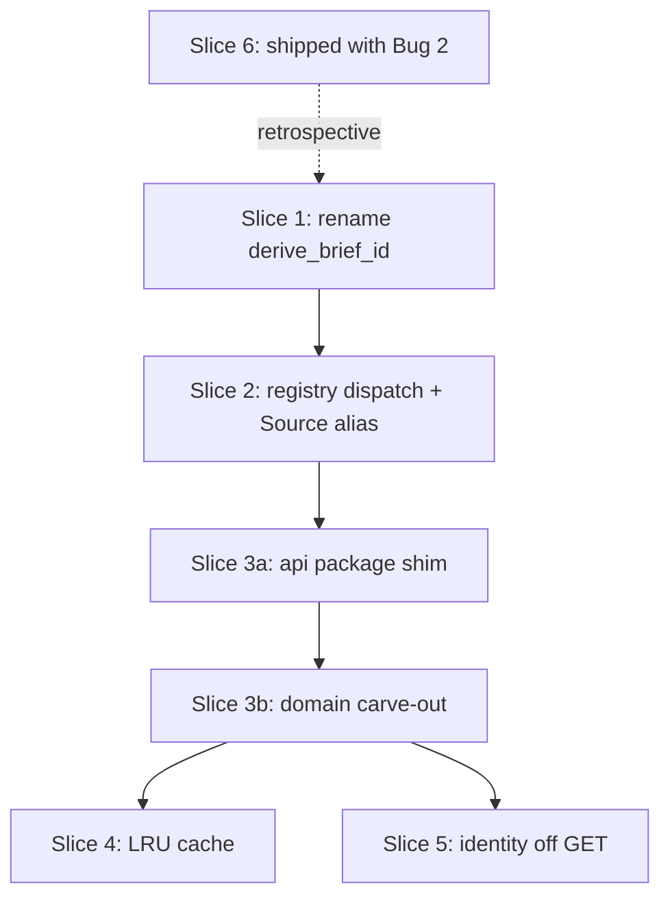

# Foundation debt cleanup

Status: ready-to-implement
Owner: Sam (with implementer agent assistance)
Last updated: 2026-05-03

## Problem

Five accreted foundations bite during routine work in `cloris/`:

1. `linkedin_state_key()` (`shared/output_paths.py:199`) is misnamed —
   it's the universal `brief_id` resolver, not LinkedIn-specific. It
   does NOT hash content (it slugifies a single ID field).
2. `Literal["linkedin", "github"]` is repeated 20 times in
   `cloris/models.py`; `cloris/api.py:2646-2655` hardcodes
   `if source == "linkedin": ... elif "github":` health imports.
3. `cloris/api.py` is **4070 lines, 52 routes** — work in any one
   domain churns the same file as every other.
4. `_resolve_brief_by_id` (`cloris/api.py:651-665`) calls
   `linkedin_state_key()` per brief on every workspace render; both
   `_scan_authored_briefs` and `linkedin_state_key` re-read each brief
   from disk.
5. `api_identity_pending` (`cloris/api.py:1735`) and
   `aggregate_workspace` (`cloris/control_plane.py:1359`) call
   `resolve_persons_for_brief` as a side effect of GET requests.

Bug 2's read-path-violation class fix already shipped alongside this
plan (5 GET endpoints migrated off `RuntimeStateStore`). Item 6 below
documents what landed; it's not future work.

## Goal

Land each item as its own reviewable PR slice so future structural
work on Cloris doesn't keep re-paying the same costs.

## Non-goals

- New product features.
- Stack-level architecture (TA Ops, Rosie, Analytics Hub).
- `output/` artifacts or draft briefs.
- `shared/runtime_state/store.py` semantics (high-risk file).

## Assumptions

- The named alias `Source = Literal["linkedin", "github"]` preserves
  static exhaustiveness; we keep `Literal` rather than raw `str` with
  runtime validation.
- `runs.brief_id` and `runs.brief_content_hash` columns stay; only the
  derivation function name changes. Callers don't care.
- Bug 2's audit closed the inventory of writer-on-read GETs.
  Item 6 is retrospective.

## Slices

### Slice 1 — rename `linkedin_state_key` to `derive_brief_id`

- Pure rename of `shared/output_paths.py:199`. Update docstring to
  lead with "derive a brief's stable id from its content (LinkedIn
  project id is the primary signal)." No semantic change.
- Files: `shared/output_paths.py` (definition); importers in
  `cloris/api.py`, `cloris/models.py`, `cloris/worker.py`,
  `cloris/control_plane.py`, `cloris/launchers/__init__.py`. Frontend
  matches (`LaunchForm.svelte`, `router.ts`) appear in comments only —
  verify before touching.
- Tests: `pytest tests/ -q -k "brief_id or state_key or output_paths"`
  then `make validate`.
- Rollback: `git revert`. Single commit.
- Size: 0.5–1 hour.
- Dependency: none. Land first.

### Slice 2 — registry-driven source dispatch

- Define `Source = Literal["linkedin", "github"]` in
  `cloris/launchers/__init__.py` next to `LAUNCHERS`.
- Replace 20 `Literal["linkedin", "github"]` declarations in
  `cloris/models.py` with `from cloris.launchers import Source`.
- Add `readiness_probe_fn: Callable[[], ReadinessReport]` to
  `LauncherEntry`; wire in `linkedin.health.probe_linkedin_readiness`
  and `github.health.probe_github_readiness`.
- Replace the if/elif at `cloris/api.py:2646-2655` with
  `LAUNCHERS[source].readiness_probe_fn()`.
- **Decision**: keep `Literal` (via alias). Switching to `str` with
  runtime validation loses mypy/pyright exhaustiveness at every
  dispatch site — that's the type-system value here.
- Tests: `pytest tests/test_launch_readiness*.py tests/ -q -k launcher`
  then `make validate`.
- Rollback: `git revert`. Source alias is additive.
- Size: 2–3 hours.
- Dependency: after Slice 1 so model-file edits churn once.

### Slice 3 — split `cloris/api.py` by domain

Turn the monolith into a `cloris/api/` package:

- `_helpers.py` — `_PROJECT_ROOT`, `_CONFIG_DIR`, `_CREDENTIAL_LABELS`,
  spawn helpers, brief resolvers, `_readiness_blockers`, exception
  classes, validation constants.
- `health.py` — `/healthz`, `/api/chrome-status`, onboarding routes.
- `runs.py` — reconcile, run report, telemetry, monitor.
- `briefs.py` — briefs list/detail/edit, versions, markets.
- `workspace.py` — workspace, candidate detail/notes/judgment.
- `launch.py` — launch-readiness, launch/resume/stop.
- `identity.py` — identity pending/decision/unlink.
- `settings.py` — settings, tools index/exec.
- `intake.py` — intake sessions + polish/restore/complete.
- `reflection.py` — reflection sessions + steering/research/commit.

**Sub-slicing** (do NOT land as one PR):

- **3a (mechanical)**: create `cloris/api/__init__.py` re-exporting
  everything from the existing `cloris/api.py`. Single commit.
  Validate. This is the rollback target for 3b.
- **3b (carve-outs)**: one commit per domain module. Run
  `make validate` after each.

- Tests: `make validate` after every commit in 3b. `make audit-ui`
  after the full split.
- Rollback: 3b mid-carve, `git revert <offending-commit>` — pre-3b
  state is `__init__.py` re-exporting the monolith.
- Size: 3a is 1 hour; 3b is ~4–6 hours across ~7 commits.
- Dependency: after Slice 2 (Source alias becomes the import target
  for split modules, avoiding a second edit pass).

### Slice 4 — LRU cache for brief id → path resolution

- **Refinement**: the per-call cost is in `_resolve_brief_by_id`
  calling `derive_brief_id()` (post-Slice-1) per brief — that function
  re-reads each brief JSON. Cache the `(brief_id → absolute_path,
  was_flat)` map, not the scanner.
- Helper keyed on `(_CONFIG_DIR, max(p.stat().st_mtime for p in
  _CONFIG_DIR.rglob("brief*.json")))`. Rebuild on mtime delta.
- Place in `cloris/api/_helpers.py` post-Slice-3.
- Tests: `pytest tests/ -q -k "brief_id or resolve_brief"`. Add a
  test asserting the cache invalidates after `Path.touch()` (with a
  `time.sleep(0.05)` to avoid mtime-resolution collisions on tmpfs).
- Rollback: `git revert`. Pure perf.
- Size: ~1 hour (~10–15 lines).
- Dependency: best after Slice 3; can land against monolith if 3 slips.

### Slice 5 — identity resolution off GET paths

- Remove `resolve_persons_for_brief(...)` calls from
  `cloris/api.py:1735` and `cloris/control_plane.py:1359`. GETs read
  pre-computed person rows only.
- Add an orchestrator finalization hook in `cloris/worker.py` (after
  the orchestrator subprocess exits cleanly) that calls
  `resolve_persons_for_brief(brief_id)` in a background-safe way.
  **Not** inside `store.finish_run` — that file is high-risk; the
  worker hook is the cleaner seam.
- Add `POST /api/brief/{brief_id}/identity/resolve` returning 202 for
  manual re-runs.
- Tests: `pytest tests/test_identity_resolution_service.py tests/ -q
  -k "identity or workspace"`. Add a test mocking
  `resolve_persons_for_brief` and asserting GET call-count is 0.
  Frontend smoke: `make audit-ui` for the workspace + identity-pending
  surfaces; pre-computed rows must render the same data.
- Rollback: `git revert`. Risk: existing recruiter data shows stale
  identity rows on workspaces not finalized post-deploy. Mitigation:
  ship the manual POST in the same PR; surface a one-shot button in
  the workspace's debug surface.
- Size: 4–6 hours. Larger than the others — the GET coupling is real
  product behavior (the side effect surfaces new candidates today).
- Dependency: independent of 1, 2, 4. After Slice 3 so the change is
  isolated to `cloris/api/identity.py`.

### Slice 6 — read-only-store-violation class fix (RETROSPECTIVE)

Shipped alongside Bug 2; documented here. Do NOT re-implement.

What landed:

- `read_models.run_telemetry()`, `list_intake_sessions()`,
  `get_intake_session()`, `get_active_reflection_for_brief()`,
  `get_reflection_session()`.
- `_intake_db_path()` helper — single seam shared by writer
  (`_intake_store`) and read GETs; tests monkeypatch one path and
  both sides redirect.
- 5 GET endpoints migrated off `RuntimeStateStore` (the cited
  `api_run_telemetry` + 4 from the population audit: intake list/get,
  reflection active/get).
- Borderline `_resolve_run_dir_for_run_id` migrated to
  `read_models.run_by_id`; the `_runtime_state_store()` helper is gone.

Remaining `RuntimeStateStore(...)` callsites in `cloris/api.py`: 4,
all legitimate writers (note appends, user_status setter,
judgment_accuracy setter, intake-write factory).

## Risks

- **Slice 3** is the biggest behavior surface. The 3a→3b split
  protects rollback; per-commit `make validate` is the only thing
  keeping subtle import-cycle / route-ordering breakage out.
- **Slice 5** loses the side-effect-on-read pattern recruiters depend
  on. The manual POST endpoint covers recovery; ship them together.

## Sequencing

## Test strategy

- Per-slice band: see each slice's "Tests" line.
- Full-suite gate before declaring any slice done: `make validate`.
- Read-models layering rule (`tests/test_read_models.py:43`) must stay
  green throughout any future read-helper additions.

## Open questions

- `tests/test_read_models_no_writer_import.py` filename inconsistency
  — `read_models.py:16` advertises this file but it doesn't exist; the
  AST-walk pin lives in `tests/test_read_models.py:43`. Out of scope;
  flag for follow-up.

## Decisions

- 2026-05-03 — rename target is `derive_brief_id`, not
  `brief_content_hash`. The function does not hash; the proposed name
  would have actively misled readers. Confirmed by Sam.
- 2026-05-03 — keep `Literal` via named alias over `str + runtime
  validation` — preserves static exhaustiveness at 20 dispatch sites.
- 2026-05-03 — Slice 5 hooks into `cloris/worker.py` finalization,
  NOT `store.finish_run`. `store.py` is high-risk; worker is the
  cleaner seam.
- 2026-05-03 — Slice 4 caches `(brief_id → path)`, not just
  `_scan_authored_briefs`. The recompute hot path is
  `derive_brief_id` re-reading each brief, not the scanner.

## Follow-ups (not in this plan)

- Identity-resolution worker-hook edge cases (sigterm mid-resolution)
  — Slice 5 expansion.
- Frontend audit for any copies of `Source` or `_intake_db_path`
  constants — verify during Slice 2.
